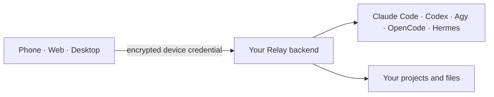

<div align="center">

# Relay

**A private remote control for AI coding agents running on your own machine.**

[中文](README.zh-CN.md) · [Backend setup](backends/README.md) ·
[Security](SECURITY.md) · [Handbook](docs/handbook.md)

</div>

Relay keeps Claude Code, Codex, Antigravity, OpenCode, and Hermes on the machine
where your projects, shell, and credentials already live. It gives you one
Flutter app for phone, Web, and desktop so you can reconnect to those local CLI
agents without moving the projects to a hosted service.

There is no Relay cloud account or default backend. You run the Node.js backend,
generate an encrypted credential, and import it into the clients you trust.



## Current capabilities

- **Live agent chat.** Stream replies, cancel turns, preserve multi-part agent
  updates, and continue long work while switching between conversations.
- **Named conversations.** Each workdir and agent supports up to eight persistent
  sessions with shared cross-device history and running-state indicators.
- **Agent status and login.** See installed/authenticated state for all five
  agents. Relay can bridge Claude, Codex, and Agy OAuth on compatible backend
  hosts; OpenCode and Hermes credentials stay host-managed.
- **Per-agent controls.** Select model, reasoning effort, and permissions in the
  composer. Claude Code and Codex also have a Fast mode switch, off by default;
  fast responses may consume more quota or cost more.
- **Live Codex catalog.** Relay reads structured model metadata and each model's
  supported reasoning levels from the installed Codex CLI, with safe fallbacks.
- **Swarms.** Put several agents in one transcript, give each member a work tree,
  model, effort, permission, nickname, and persona, then summon members with
  `@mentions`. Multiple members run in parallel from one transcript snapshot.
  Swarms can be saved and imported as JSON templates.
- **Read-only BTW side conversations.** Ask Claude, Codex, or Agy a side question
  without changing the main task's native session.
- **Remote files.** Browse absolute paths allowed by the backend, change the
  workdir, upload files, and download files or zipped folders.
- **SSH terminal.** Open **Manage credentials → Enter SSH** for one resumable
  terminal on the current backend machine. It runs as the backend OS user and
  follows the app's Light/Dark appearance. Web bundles a terminal monospace
  font so Chromium keeps normal horizontal character spacing.
- **Quota workflows.** View Claude, Codex, and Agy usage. Claude and Codex can
  queue one prompt for the next detected five-hour reset.
- **Notifications.** Live local/browser alerts plus optional Web Push and Android
  FCM for configured deployments.

## Quick start

### 1. Prepare a backend

You need a Linux, macOS, or Windows machine with Node.js 18+ and at least one
supported CLI installed. Claude, Codex, and Agy must be logged in; OpenCode and
Hermes provider setup is managed on that host.

From the repository root, run the setup for the backend OS:

```bash
./backends/linux/setup.sh
```

```bash
./backends/macos/setup.sh
```

```powershell
.\backends\windows\setup.ps1
```

The installer offers three network modes:

| Mode | Use case | Important detail |
|---|---|---|
| Direct | Your own public address or reverse proxy | Use HTTPS before public exposure. |
| Named Cloudflare Tunnel | Stable personal deployment | Requires a Cloudflare zone and `cloudflared`. |
| Cloudflare Quick Tunnel | Short trial | URL may rotate after restart. |

See [backends/README.md](backends/README.md) for service commands and platform
details.

### 2. Import the device credential

Setup prints an encrypted QR and saves `.relay.png` / `.relay.json` under
`server/credentials/`. Import it by camera scan, image/file selection, or pasted
JSON, then enter the passphrase chosen during generation. Generate a separate
credential for each device.

The app's first connection screen also contains a **Deploy backend** walkthrough.

### 3. Choose a workdir and agent

Select a machine, set the backend workdir, and open an agent conversation or
Swarm. The active workdir is stored per client and sent with every API request.

## Security summary

- All HTTP API routes require a revocable bearer token.
- The SSH terminal uses a short-lived, single-use WebSocket ticket derived from
  that token; the long-lived bearer token is never placed in the socket URL.
- Credential exports are encrypted with PBKDF2-HMAC-SHA256 and AES-256-GCM.
- The file API denies a specific set of Relay, SSH, Claude, and Codex secrets and
  can be restricted further with `RELAY_FS_ROOTS`.
- Failed bearer-token attempts are rate-limited.
- Public deployments should terminate TLS and run Relay as a restricted non-root
  user.

Relay is not a sandbox: every CLI and SSH terminal process has the permissions
of the backend OS user. Read [SECURITY.md](SECURITY.md) and the
[production checklist](docs/handbook.md#production-deployment) before exposing
a backend outside a trusted network.

## Development

```bash
flutter pub get
flutter analyze --no-pub
flutter test --no-pub
npm --prefix server test
```

Run the client with `flutter run`. For a self-hosted Web build:

```bash
flutter build web --no-pub --pwa-strategy=none --no-web-resources-cdn
npm --prefix server start
```

Desktop runner projects exist for Windows, macOS, and Linux. Windows release
builds have been exercised; macOS/Linux packaging and secure-storage validation
are still less mature. See [the handbook](docs/handbook.md#development-and-builds).

## Project layout

```text
Relay/
├── lib/          shared Flutter client
├── server/       Node.js backend and tests
├── backends/     OS-specific install/service adapters
├── assets/       icons and UI assets
├── docs/         durable operations and architecture handbook
├── scripts/      development and deployment helpers
└── test/         Flutter tests
```

Contributors and coding agents should read [AGENTS.md](AGENTS.md). Release
history is in [CHANGELOG.md](CHANGELOG.md).
