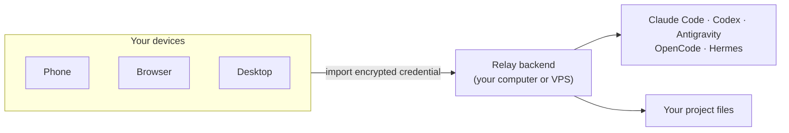

<div align="center">

# Relay

**A private remote control for the AI coding agents already running on your own machine.**

[中文文档](README.zh-CN.md) · [Security](SECURITY.md) · [Roadmap](docs/ROADMAP.md) · [Handbook](docs/handbook.md)

</div>

Claude Code, Codex, Antigravity, OpenCode, and Hermes are most useful on the
computer where your projects, shells, and credentials already live. Relay keeps
them there, then gives you a clean app on your **phone, browser, or desktop** so
you can keep working from the couch, the office, or anywhere with a network path
back to that machine.

Relay is not a hosted cloud service. There is no Relay account, no shared Relay
server, and no default backend address baked into the app. You connect only to a
backend you run, using an encrypted QR credential that you generate and protect
with your own password.



## Why Relay

- **No SSH juggling.** Chat with local CLI agents from one app instead of
  keeping terminals open on every device.
- **One control surface.** Switch between agents, sessions, models, reasoning
  effort, and permission levels from the same composer.
- **Work keeps running.** Long turns stream live, can continue while you move
  between sessions, and can notify you when they finish.
- **Multi-agent Swarms.** Put several agents in one shared transcript and
  summon them with `@mentions`; multiple agents can answer in parallel from the
  same conversation snapshot.
- **Files are within reach.** Browse the backend machine, switch workdirs,
  upload files, and download files or folders without leaving the app.
- **Quota-aware workflows.** Watch Claude Code, Codex, and Antigravity usage,
  queue a message for the next quota reset, and receive reset notifications.

## Security Model

Relay is designed so the control plane stays in your hands:

- **Self-hosted backend.** The app talks to a Node backend running on a machine
  you own or administer.
- **No Relay cloud account.** The project does not provide a hosted relay server
  that sees your prompts, files, tokens, or agent output.
- **Encrypted credential import.** The setup script creates a QR/JSON envelope
  using PBKDF2-SHA256 and AES-256-GCM. The password is never written to disk.
- **Revocable device tokens.** Each imported credential carries a bearer token
  stored by the app in platform secure storage. Tokens can be revoked and
  deleted from the backend.
- **Rate-limited auth failures.** Wrong-token attempts are throttled, while
  normal authenticated streaming traffic is not.
- **Sensitive file guardrails.** The file API refuses Relay secrets, `.env`,
  credential exports, push token stores, `~/.ssh`, and known CLI auth files.
  Deployments can further narrow file access with `RELAY_FS_ROOTS`.
- **HTTPS-first deployment.** Named Cloudflare Tunnel or a TLS reverse proxy is
  recommended for anything reachable beyond localhost. If a routable `http://`
  URL is configured, the backend warns loudly at startup.

Relay does not sandbox the CLI agents themselves. The backend launches real
local tools with the permissions of the OS user running the backend, so keep the
backend user scoped to the projects it should touch and use each agent's
permission mode intentionally. See [SECURITY.md](SECURITY.md) and the
[production handbook](docs/handbook.md#production-deployment) before exposing a
backend publicly.

## What It Looks Like

### Home: Your Command Center

Home shows the active machine, recent Swarms, recent agent sessions, and a
Getting started entry, so every device lands on the same workspace view.

<div align="center">
  
</div>

### One Chat App for Every Agent

Switch between Claude Code, Codex, Antigravity, OpenCode, and Hermes in one
interface. Replies stream live; multi-part agent updates are timestamped and
collapsible; model, effort, and permission controls sit in the composer.

<div align="center">
  
</div>

### Swarm: A Team of Agents in One Transcript

Create a Swarm, choose its work tree, add members, and give each member its own
model, permission level, nickname, and persona. Mention one or more members in a
message; every mentioned agent answers from the same transcript snapshot.

<div align="center">
  
</div>

### Quotas and Scheduled Messages

Watch remaining Claude Code, Codex, and Antigravity quota. Queue a prompt for
the next 5-hour reset, and receive native notifications for quota resets or
scheduled-message results.

<div align="center">
  
</div>

### Files on the Backend Machine

Browse project folders, change the active workdir, upload files, and download
files or zipped folders from the same remote control surface.

<div align="center">
  
</div>

## Quick Start

You need:

- A backend machine you control: Linux, macOS, Windows, or a VPS.
- Node.js 18+ on that backend machine.
- At least one installed and logged-in CLI agent: Claude Code, Codex,
  Antigravity, OpenCode, or Hermes.
- The Relay app or Web build on the device you want to use as the controller.

From the Relay repository root on the backend machine, run the setup script for
that OS:

```bash
./backends/linux/setup.sh
```

```bash
./backends/macos/setup.sh
```

```powershell
.\backends\windows\setup.ps1
```

The setup script asks how the app should reach the backend:

| Mode | Best For | Notes |
|------|----------|-------|
| Direct mode | VPS or host with your own public IP/domain | Put HTTPS in front for public use. |
| Cloudflare Tunnel | Stable personal deployment | Uses your own Cloudflare zone and a stable hostname. |
| Cloudflare Quick Tunnel | Fast trial | No domain needed, but the URL can rotate after restart. |

After setup, Relay prints an encrypted credential QR and saves a matching JSON
file under `server/credentials/`. Open Relay and import it by camera scan, QR
image upload, or paste. Enter the password you set during credential generation,
then start working.

The app also includes a **Deploy backend** guide on the first connection screen
with the same five-step flow.

## Production Notes

For a stable deployment:

- Prefer `HOST=127.0.0.1` behind Cloudflare Tunnel, Caddy, Nginx, or another
  TLS-terminating proxy.
- Set `PUBLIC_BASE_URL` to the exact HTTPS URL users import.
- Generate one credential per device and revoke old device tokens instead of
  sharing a long-lived token.
- Run the backend as a non-root user with access only to intended workdirs.
- Use `RELAY_FS_ROOTS` if the file browser should be limited to specific
  directories.

The full checklist is in [docs/handbook.md](docs/handbook.md#production-deployment).

## More Screens

<div align="center">
  
  
  
</div>

## Project Layout

```text
Relay/
├── assets/       app resources: screenshots, icons, agent artwork
├── backends/     Linux, macOS, and Windows backend setup scripts
├── lib/          Flutter client for mobile, Web, and desktop
├── server/       Node backend that fronts local CLI agents
├── docs/         handbook, roadmap, and contributor notes
└── scripts/      local development and build helpers
```

Contributing or digging into internals? Start with [docs/AGENT.md](docs/AGENT.md)
and the [Handbook](docs/handbook.md).
