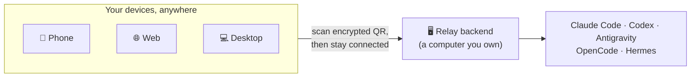
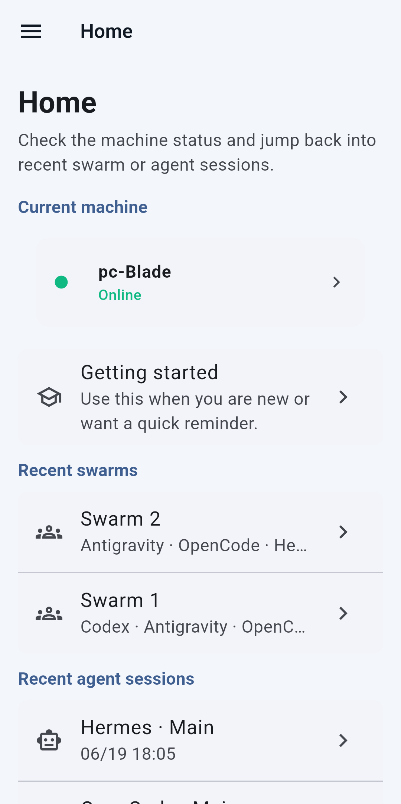
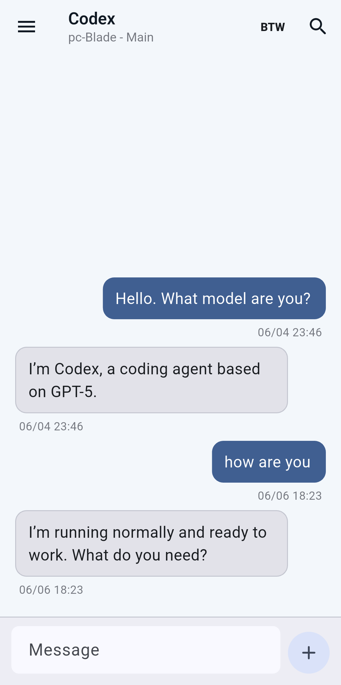
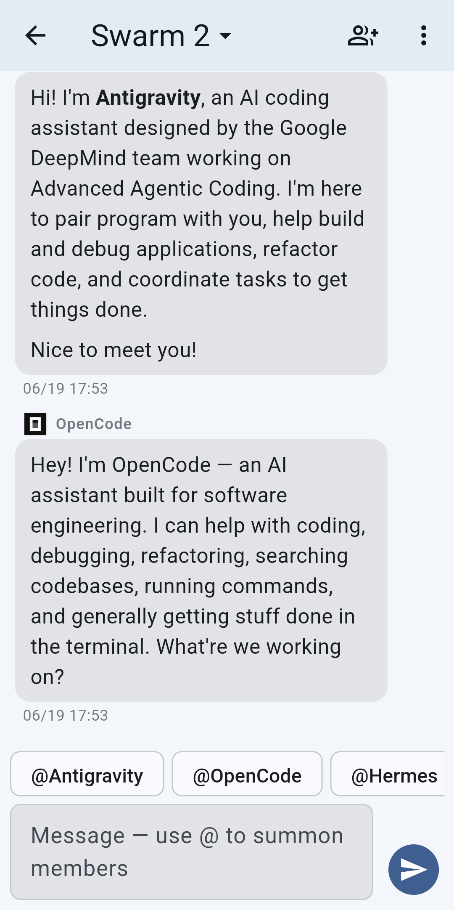
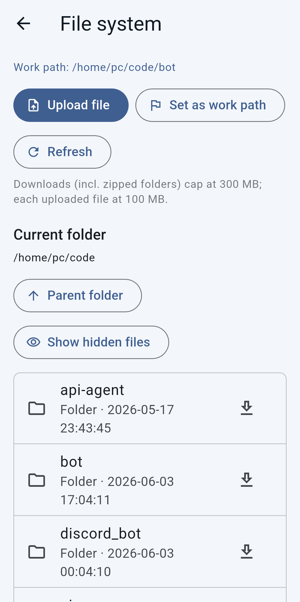
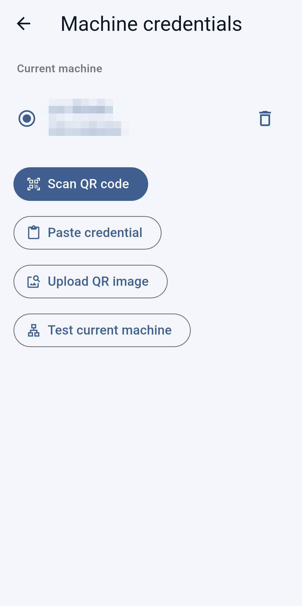
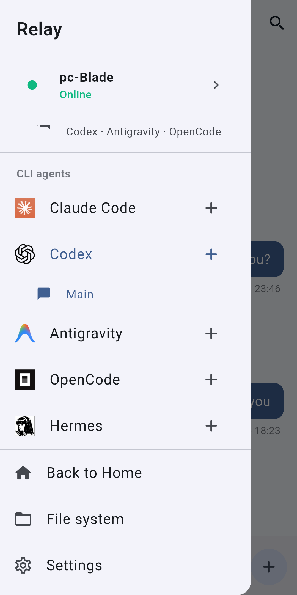
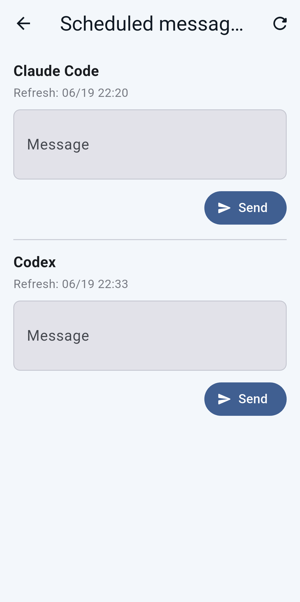
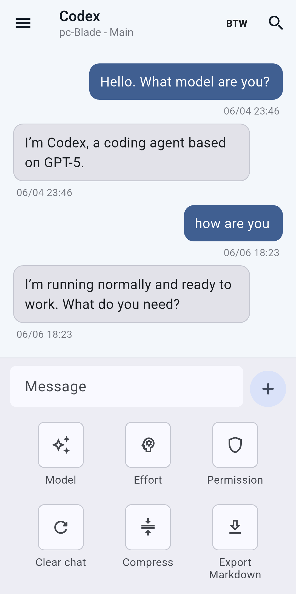

<div align="center">

# Relay

**Your AI coding agents live on your computer. Relay puts them in your pocket.**

[中文文档](README.zh-CN.md) · [Roadmap](docs/ROADMAP.md) · [Handbook](docs/handbook.md)

</div>

The most capable AI coding agents — **Claude Code, Codex, Antigravity** — run as
command-line tools, tied to the machine they're installed on. Relay frees them
from that machine. Keep the agents running on your home PC, Mac, or a cloud
server, then drive them from a clean app on your **phone, browser, or desktop** —
from the couch, the office, or anywhere.

Nothing runs on our servers. There's no account to create and no default address
baked into the app: you connect **only** to a backend you control, after scanning
an encrypted QR code that you generate and protect with your own password.



---

## What you can do with it

### Start from Home

Home shows the active machine, recent Swarms, recent agent sessions, and a
Getting started entry, so every device lands on the same command center.

<div align="center">
  
</div>

### One app, every agent

Switch between Claude Code, Codex, Antigravity, OpenCode, and Hermes in a single
chat — no separate terminals, no SSH. Replies stream in live, each follow-up note
timestamped and collapsible, so a long task stays readable. Pick the model,
reasoning effort, and permission level right from the composer.

<div align="center">
  
</div>

### Swarm — a whole team of agents in one chat

Build a **Swarm**: several agents sharing one transcript. Summon them by name
with `@mentions`, and mention more than one in a single message to have them work
**in parallel** — each from the same snapshot of the conversation. Give every
member its own model, permissions, nickname, and persona: a read-only reviewer
next to a write-enabled builder, on whatever models you choose.

<div align="center">
  
</div>

### Never get surprised by a quota reset

See how much of your Claude Code, Codex, and Antigravity allowance is left at a
glance. Queue a message to send itself the moment a 5-hour window resets, and get
a native notification when your quota is back — even if the app is fully closed.

<div align="center">
  
</div>

### Reach in and work with the files

Browse the backend machine's folders, switch the working directory, and upload or
download files — straight from your phone, with downloads landing in your system
Downloads folder.

<div align="center">
  
</div>

---

## How it works

Three steps, then you're connected for good:

1. **Run the backend** on a computer you own — a home PC, an always-on
   workstation, or a cloud VPS.
2. **Scan the QR** it generates and type the password you chose. The credential
   is encrypted end to end; we never see it.
3. **Start working.** Your chats, sessions, and history live on the backend, so
   any device you connect picks up exactly where you left off.

<div align="center">
  
</div>

---

## Get started

You need a backend machine with **Node.js 18+** and at least one logged-in CLI
agent (Claude Code, Codex, Antigravity, OpenCode, or Hermes). From the repo root,
run the script for that machine's OS:

```bash
./backends/linux/setup.sh
```

```bash
./backends/macos/setup.sh
```

```powershell
.\backends\windows\setup.ps1
```

Setup asks how the app should reach the backend:

- **Direct mode** — for a VPS or host with a reachable public IP/domain.
- **Cloudflare Tunnel** — a stable HTTPS address under your own domain.
- **Cloudflare Quick Tunnel** — the fastest trial path; no domain needed, but the
  URL may change.

It then starts the backend and prints an encrypted credential QR (plus a matching
JSON file). Open Relay, scan the QR or import the JSON, enter your password, and
you're in. For a stable, hardened deployment, see the
[Handbook](docs/handbook.md).

> **Want the native desktop app?** Relay's desktop builds are real Flutter apps
> (no Electron). Build steps for Windows, macOS, and Linux are in the
> [Handbook](docs/handbook.md#desktop-builds).

---

## More screens

<div align="center">
  
  
  
</div>

---

## Project layout

```text
Relay/
├── assets/       app resources (agent icons, screenshots, app icon)
├── backends/     Linux, macOS, and Windows backend setup scripts
├── lib/          Flutter frontend for mobile, Web, and desktop
├── server/       Node backend that fronts the local CLI agents
├── docs/         roadmap, handbook, and contributor notes
└── scripts/      local development and build helpers
```

Contributing or digging into internals? Start with [docs/AGENT.md](docs/AGENT.md)
and the [Handbook](docs/handbook.md).
