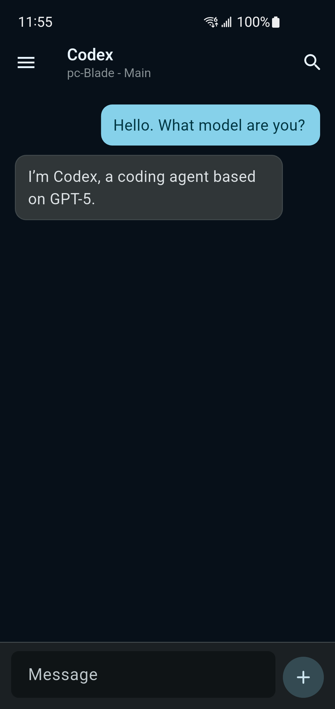
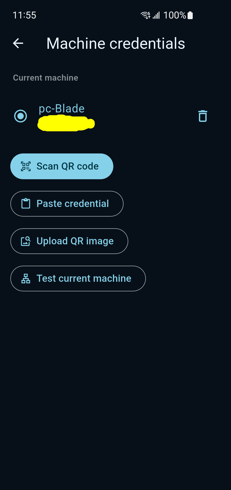
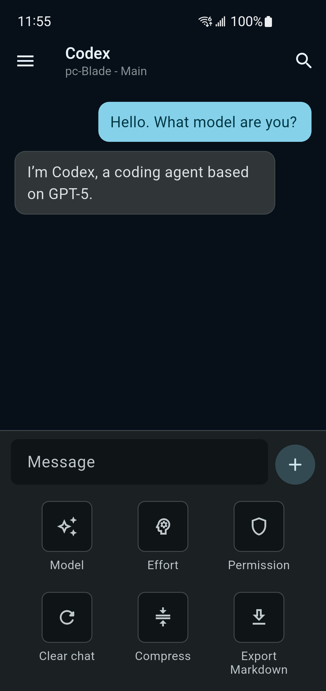
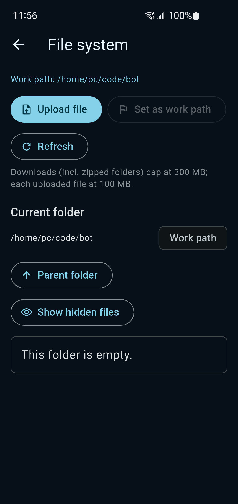
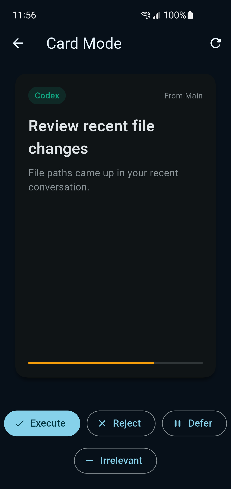
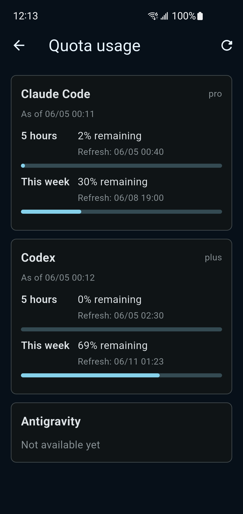

# Relay

[中文文档](README.zh-CN.md) | [Roadmap](docs/ROADMAP.md) | [Production hardening](docs/production-hardening.md)

Relay is a private control surface for CLI agents. You can open the same frontend on mobile, Web, or desktop, then connect it to a backend you control. The backend can run on a home PC / Mac, a workstation, or a cloud VPS.

The app ships with no built-in backend URL. A client must scan an encrypted credential QR code generated by the backend and enter the password chosen by the user before it can connect.

After connection, Relay turns day-to-day CLI-agent work into one chat surface: switch between Claude Code, Codex, and Antigravity; choose a work directory; keep multiple sessions; read streaming agent replies; manage files; check quota; and use Card Mode to confirm the next action with a gesture.

## Current Capabilities

- One backend can serve multiple frontend devices; mobile, Web, and desktop can return to the same work directory and session.
- Claude Code, Codex, and Antigravity can be used from the same app.
- Chat history and resumable CLI context live on the backend, so reopening the app can continue previous work.
- The file system screen can browse backend folders, change the work path, upload files, and download files.
- Quota dialogs, scheduled messages, and system notifications help track Claude Code / Codex availability.
- Card Mode generates suggestions from recent sessions, so the user can confirm, defer, or discard them with gestures.

## Repository Layout

```text
Relay/
├── backends/             Linux, macOS, and Windows backend setup scripts
├── lib/                  Flutter frontend for mobile, Web, and desktop
├── server/               Node backend running on a local machine or VPS
├── docs/                 roadmap, production hardening, desktop, and agent notes
└── scripts/              local development and build helpers
```

For development details, see [AGENT.md](docs/AGENT.md).

## Backend Quick Start

Pick a machine to act as the backend: a home PC / Mac, an always-on workstation, or a VPS. The backend machine needs Node.js 18 or newer, plus at least one logged-in CLI agent from Claude Code, Codex, or Antigravity.

Then run the matching setup script from the repository root:

```bash
./backends/linux/setup.sh
```

```bash
./backends/macos/setup.sh
```

```powershell
.\backends\windows\setup.ps1
```

Setup asks how the app should reach the backend:

- **Direct mode**: for a VPS or host with a reachable public IP/domain.
- **Cloudflare Tunnel**: for a stable HTTPS address under your own domain.
- **Cloudflare Quick Tunnel**: the fastest trial path; no domain required, but the URL may change.

The script starts the backend and generates both an encrypted credential QR code and a matching JSON credential file. Open the Relay app, scan the QR or import the JSON file, enter the password you chose, and the frontend connects to that backend.

## Frontend Demo

<p>
  
  
  
  
  
  
  
  
</p>
