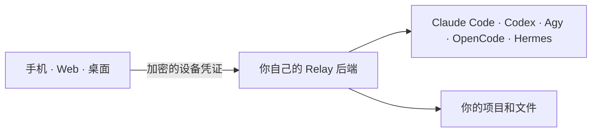

<div align="center">

# Relay

**一个连接并控制自有机器上 AI 编程智能体的私有远程控制台。**

[English](README.md) · [后端安装](backends/README.zh-CN.md) ·
[安全模型](SECURITY.md) · [技术手册](docs/handbook.md)

</div>

Relay 让 Claude Code、Codex、Antigravity、OpenCode 和 Hermes 继续运行在已经准备好项目、
shell 与登录态的机器上，再通过同一个 Flutter app 从手机、Web 或桌面重新连接这些本地
CLI 智能体，不需要把项目搬到托管服务。

Relay 没有云端账号，也没有内置的默认后端。你自己运行 Node.js 后端、生成加密凭证，
再把凭证导入信任的客户端。



## 当前能力

- **实时智能体聊天。** 流式显示回复、取消任务、保留多段 agent 更新；切换会话后长任务
  仍可继续运行。
- **命名会话。** 每个工作目录与 agent 最多有 8 个持久会话，聊天历史和运行状态可在
  多设备间同步。
- **Agent 状态与登录。** 查看五种 agent 的安装和认证状态。兼容的后端可为 Claude、
  Codex、Agy 中转 OAuth；OpenCode 与 Hermes 的密钥仍由后端主机管理。
- **按 agent 配置。** 在输入区选择模型、思考深度和权限。Claude Code 与 Codex 还会
  显示默认关闭的快速模式；快速响应可能消耗更多额度或产生更高费用。
- **Codex 动态目录。** 从已安装 Codex CLI 的结构化元数据读取模型与每个模型支持的
  思考档位，并提供安全的回退目录。
- **蜂群。** 多个 agent 共享一份记录；每位成员可设置工作树、模型、思考深度、权限、
  昵称和人设。用 `@` 召唤成员，同一条消息中的多个成员会基于同一快照并行运行。
  蜂群还可保存和导入 JSON 模板。
- **只读 BTW 旁路对话。** 向 Claude、Codex 或 Agy 提问而不改变主任务的原生会话。
- **远程文件。** 浏览后端允许的绝对路径、切换工作目录、上传文件、下载文件或压缩文件夹。
- **SSH 终端。** 从“管理凭证 → 进入SSH”打开当前后端机器上唯一且可恢复的终端；终端
  使用后端系统用户运行，并跟随 app 的“白天/黑夜”外观。Web 端内置等宽终端字体，
  避免 Chromium 中的字符横向间距过大。
- **额度工作流。** 查看 Claude、Codex 和 Agy 额度；只有 Claude 与 Codex 可以预约在
  下一个检测到的 5 小时额度重置后自动发送一条消息。
- **通知。** 在线时使用本地/浏览器通知；配置后还可使用 Web Push 和 Android FCM。

## 快速开始

### 1. 准备后端

准备一台安装了 Node.js 18+ 的 Linux、macOS 或 Windows 主机，并至少安装一个支持的
CLI。Claude、Codex 和 Agy 需要登录；OpenCode 与 Hermes 的 provider 配置在主机完成。

在仓库根目录运行后端系统对应的命令：

```bash
./backends/linux/setup.sh
```

```bash
./backends/macos/setup.sh
```

```powershell
.\backends\windows\setup.ps1
```

安装器提供三种网络模式：

| 模式 | 适合场景 | 重要说明 |
|---|---|---|
| 直连 | 自有公网地址或反向代理 | 公开暴露前必须使用 HTTPS。 |
| 正式 Cloudflare Tunnel | 稳定的个人部署 | 需要 Cloudflare zone 和 `cloudflared`。 |
| Cloudflare Quick Tunnel | 短期试用 | 重启后 URL 可能变化。 |

服务命令和各平台细节见 [backends/README.zh-CN.md](backends/README.zh-CN.md)。

### 2. 导入设备凭证

安装完成后会打印一张加密二维码，并在 `server/credentials/` 下保存 `.relay.png` /
`.relay.json`。通过相机、图片/文件或粘贴 JSON 导入，再输入生成时设置的密码。每台设备
应单独生成一份凭证。

app 的首次连接页也内置了“部署后端”向导。

### 3. 选择工作目录与 agent

选择机器、设置后端工作目录，然后打开 agent 会话或蜂群。当前工作目录保存在每个客户端
本地，并随每次 API 请求发送。

## 安全摘要

- 所有 HTTP API 都需要可撤销的 bearer token。
- SSH 终端用该 token 换取短时、一次性的 WebSocket 票据，长期 bearer token 不会进入
  WebSocket 地址。
- 凭证导出使用 PBKDF2-HMAC-SHA256 与 AES-256-GCM 加密。
- 文件 API 会拒绝一组明确的 Relay、SSH、Claude 与 Codex 敏感路径，并可用
  `RELAY_FS_ROOTS` 进一步限制。
- 错误 token 尝试会被限速。
- 公网部署应终止 TLS，并使用权限受限的非 root 系统用户运行 Relay。

Relay 不是沙箱：CLI 与 SSH 终端进程都拥有后端系统用户的权限。对外暴露前请阅读
[SECURITY.md](SECURITY.md) 与[生产部署清单](docs/handbook.md#production-deployment)。

## 开发

```bash
flutter pub get
flutter analyze --no-pub
flutter test --no-pub
npm --prefix server test
```

使用 `flutter run` 启动客户端。自托管 Web 构建：

```bash
flutter build web --no-pub --pwa-strategy=none --no-web-resources-cdn
npm --prefix server start
```

项目包含 Windows、macOS、Linux 桌面 runner。Windows release 已实际验证；macOS/Linux
打包和安全存储验证仍不如 Windows 成熟。详见[技术手册](docs/handbook.md#development-and-builds)。

## 项目结构

```text
Relay/
├── lib/          共享 Flutter 客户端
├── server/       Node.js 后端与测试
├── backends/     各系统安装和服务管理适配
├── assets/       图标与界面资源
├── docs/         长期运维和架构手册
├── scripts/      开发与部署脚本
└── test/         Flutter 测试
```

贡献者和编程 agent 请先阅读 [AGENTS.md](AGENTS.md)，版本记录见
[CHANGELOG.md](CHANGELOG.md)。
