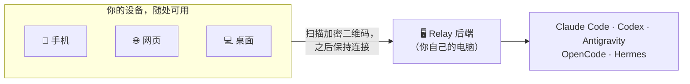

<div align="center">

# Relay

**你的 AI 编程智能体跑在你的电脑上，Relay 把它们装进你的口袋。**

[English](README.md) · [路线图](docs/ROADMAP.zh-CN.md) · [技术手册](docs/handbook.md)

</div>

最强的 AI 编程智能体——**Claude Code、Codex、Antigravity**——都是命令行工具，绑死在
安装它们的那台机器上。Relay 把它们解放出来：让智能体继续跑在你家里的 PC、Mac 或一台
云服务器上，然后从手机、浏览器或桌面端一个干净的 app 里操控它们——在沙发上、在公司、
在任何地方。

没有任何东西跑在我们的服务器上。不用注册账号，app 里也没有内置任何默认地址：你只会连接到
**你自己掌控的后端**，方式是扫描一张由你生成、并用你自己的密码保护的加密二维码。



---

## 你能用它做什么

### 从首页开始

首页会展示当前机器、最近使用的蜂群、最近使用的智能体会话和“开始使用”入口，
每台设备打开后都能回到同一个控制中心。

<div align="center">
  
</div>

### 一个 app，所有智能体

在同一个聊天界面里切换 Claude Code、Codex、Antigravity、OpenCode 和 Hermes——
不用开多个终端，也不用 SSH。回复实时流式呈现，每条后续说明都有独立时间戳、可折叠，
再长的任务也读得清楚。模型、思考深度、权限级别都能直接在输入框里选。

<div align="center">
  
</div>

### 蜂群（Swarm）——一整支智能体团队，同处一个聊天

组建一个**蜂群**：多个智能体共享同一份对话记录。用 `@` 点名召唤，
在一条消息里召唤多个成员，他们就会**并行**工作——每个都基于同一份对话快照。
每个成员都能有自己的模型、权限、昵称和人设：一个只读的审阅者，
搭配一个可写的执行者，各自用你选定的模型。

<div align="center">
  
</div>

### 再也不会被额度重置打个措手不及

一眼看清 Claude Code、Codex、Antigravity 还剩多少额度。预约一条消息，
在 5 小时窗口重置的那一刻自动发出；额度恢复时收到系统通知——哪怕 app 已经完全关闭。

<div align="center">
  
</div>

### 直接伸手处理文件

浏览后端机器上的目录、切换工作路径、上传和下载文件——都在手机上完成，
下载的文件直接落到系统的「下载」文件夹。

<div align="center">
  
</div>

---

## 工作原理

三步，之后就一直连着：

1. **跑起后端**：在你自己的电脑上——家里的 PC、一直开机的工作站，或一台云 VPS。
2. **扫码连接**：扫描它生成的二维码，输入你设置的密码。凭证端到端加密，我们看不到。
3. **开始干活**：聊天、会话和历史都存在后端，所以你换任何设备连上来，
   都能从上次停下的地方接着继续。

<div align="center">
  
</div>

---

## 快速开始

你需要一台后端机器，装有 **Node.js 18 或更高版本**，并且已经登录至少一个 CLI 智能体
（Claude Code、Codex、Antigravity、OpenCode 或 Hermes）。在仓库根目录，
运行对应操作系统的脚本：

```bash
./backends/linux/setup.sh
```

```bash
./backends/macos/setup.sh
```

```powershell
.\backends\windows\setup.ps1
```

安装过程中会让你选择 app 怎么连到后端：

- **直连模式**——适合有公网 IP / 域名的 VPS 或主机。
- **Cloudflare Tunnel**——在你自己的域名下获得稳定的 HTTPS 地址。
- **Cloudflare Quick Tunnel**——最快的试用方式，不需要域名，但地址可能会变。

脚本随后会启动后端，并打印一张加密凭证二维码（以及配套的 JSON 文件）。打开 Relay，
扫码或导入 JSON，输入你的密码，就连上了。想要稳定、加固的正式部署，
见[技术手册](docs/handbook.md)。

> **想要原生桌面 app？** Relay 的桌面版是真正的 Flutter 应用（不是 Electron）。
> Windows、macOS、Linux 的构建步骤见[技术手册](docs/handbook.md#desktop-builds)。

---

## 更多界面

<div align="center">
  
  
  
</div>

---

## 项目结构

```text
Relay/
├── assets/       app 资源（agent 图标、截图、app 图标）
├── backends/     Linux、macOS、Windows 后端安装脚本
├── lib/          Flutter 前端，覆盖移动端、Web 和桌面端
├── server/       本机或 VPS 上运行的 Node 后端，对接本地 CLI 智能体
├── docs/         路线图、技术手册和贡献者笔记
└── scripts/      本地开发和构建辅助脚本
```

想参与贡献或深入内部实现？先看 [docs/AGENT.md](docs/AGENT.md) 和[技术手册](docs/handbook.md)。
