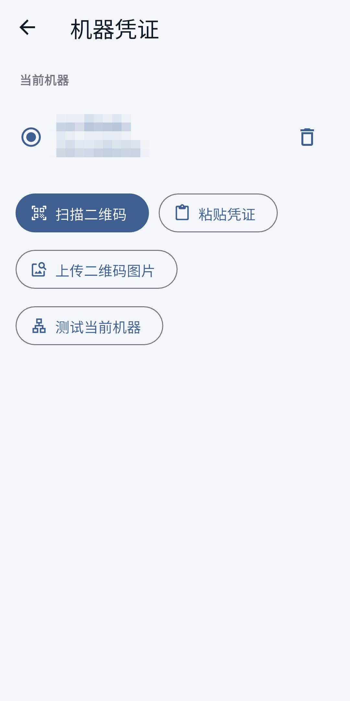
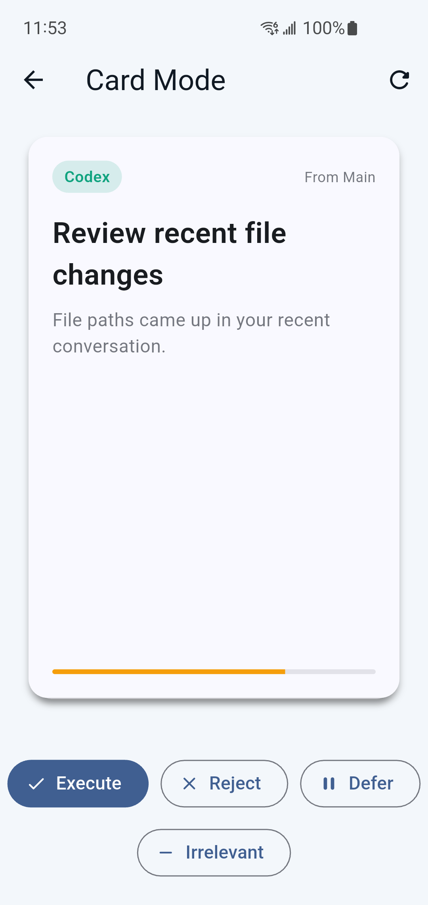

# Relay

[English](README.md) | [路线图](docs/ROADMAP.zh-CN.md) | [生产加固指南](docs/production-hardening.zh-CN.md)

Relay 是一个私有 CLI 智能体控制台。你可以在手机、Web 或桌面端打开同一个前端，把它连接到自己的后端；这个后端可以跑在家里的 PC / Mac 上，也可以跑在云端 VPS 上。

app 不内置任何默认后端地址。首次连接必须扫描后端生成的加密凭证二维码，并输入用户自己设置的密码。

连接之后，Relay 会把 CLI agent 的日常使用集中到一个聊天界面里：你可以切换 Claude Code、Codex、Antigravity、OpenCode 和 Hermes，选择工作目录，保留多个会话，查看 agent 的流式回复（每条消息独立时间戳），在不干扰主任务的前提下提问旁路问题（BTW sidekick），管理文件，检查额度，并用卡片模式快速确认下一步动作。

## 当前能力

- 一个后端可以连接多个前端设备；手机、Web 和桌面端都能回到同一个工作目录和会话。
- 支持 Claude Code、Codex、Antigravity、OpenCode 和 Hermes，在同一个 app 里切换使用。Experimental agent 在其 CLI 安装后自动出现。
- 聊天记录和可续接 CLI 上下文保存在后端，重开 app 后可以继续之前的工作。
- 多段消息：每次 assistant 回复独立时间戳，前面的"思考"步骤可折叠。
- BTW (by the way) sidekick：只读旁路提问，fork 主 session 不干扰主任务。
- 文件系统入口可以浏览后端机器上的目录、切换工作路径、上传和下载文件。
- 额度弹窗、定时消息和系统通知帮助你跟踪 Claude Code / Codex 的可用时间。
- 卡片模式会根据近期会话生成建议，用户只需要通过手势确认、稍后处理或丢弃。

## 项目结构

```text
Relay/
├── assets/               app 资源（agent 图标、截图、app 图标）
├── backends/             Linux、macOS、Windows 后端安装脚本
├── lib/                  Flutter 前端，覆盖移动端、Web 和桌面端
├── server/               本机或 VPS 上运行的 Node 后端
├── docs/                 路线图、生产加固、桌面端和 agent 工作文档
└── scripts/              本地开发和构建辅助脚本
```

更多开发细节见 [AGENT.md](docs/AGENT.md)。

## 后端快速开始

先准备一台你愿意作为后端的机器：家里的 PC / Mac、一直开机的工作站，或者一台 VPS 都可以。后端机器需要能运行 Node.js 18 或更高版本，并且已经安装并登录 Claude Code、Codex、Antigravity、OpenCode、Hermes 其中至少一个 CLI agent。

然后在仓库根目录运行对应平台的安装脚本：

```bash
./backends/linux/setup.sh
```

```bash
./backends/macos/setup.sh
```

```powershell
.\backends\windows\setup.ps1
```

安装过程中会让你选择连接方式：

- **直连模式**：适合有公网 IP 或固定域名的 VPS / 主机。
- **Cloudflare Tunnel**：适合已经有自己的域名，并想要稳定 HTTPS 地址。
- **Cloudflare Quick Tunnel**：最快试用方式，不需要提前准备域名，但地址可能会变化。

脚本会启动后端，并生成加密凭证二维码和对应的 JSON 凭证文件。打开 Relay app，扫描二维码或导入 JSON 文件，再输入你设置的密码，就可以连接这台后端。

## 前端演示

<p>
  
  
  
  
  
  
  
  
</p>
