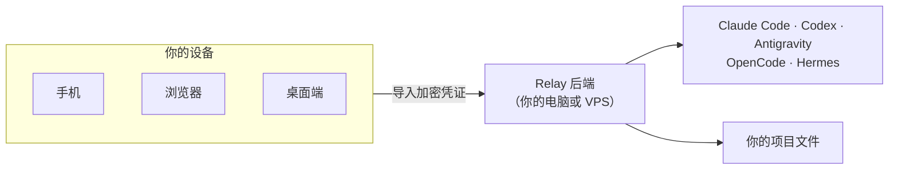
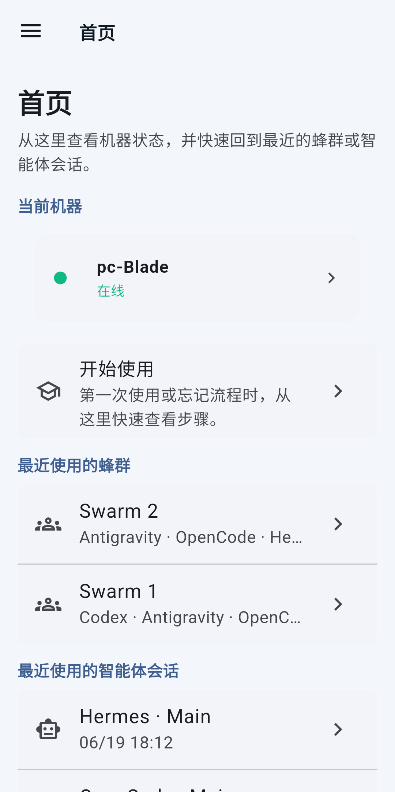
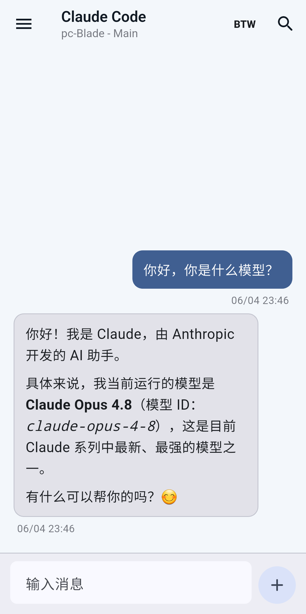
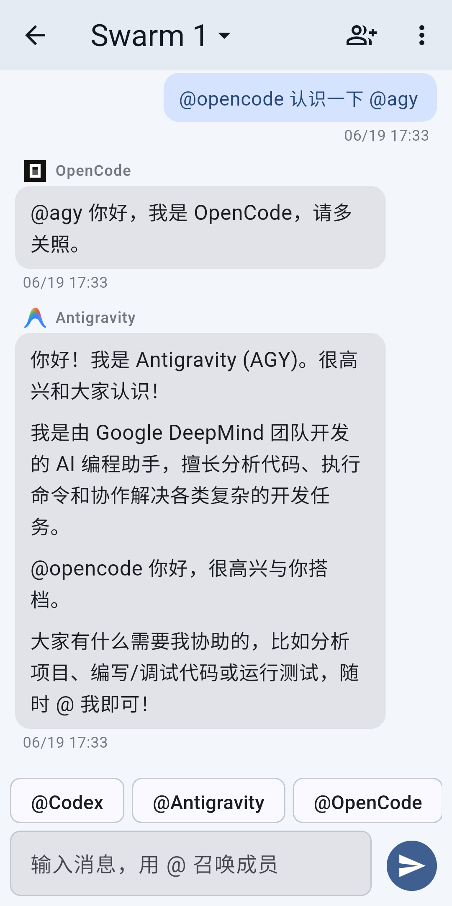
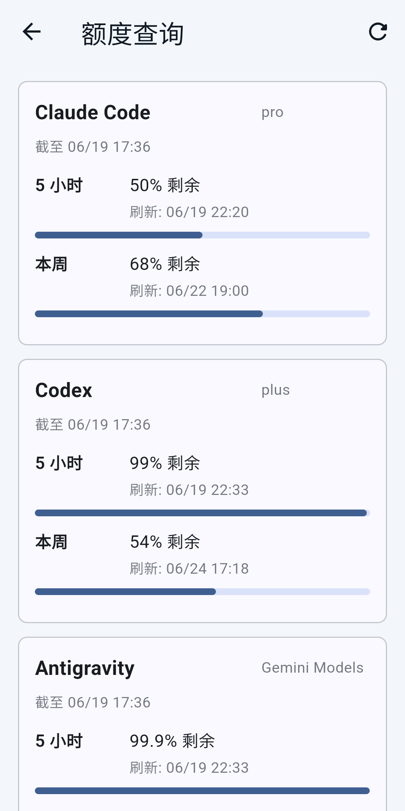
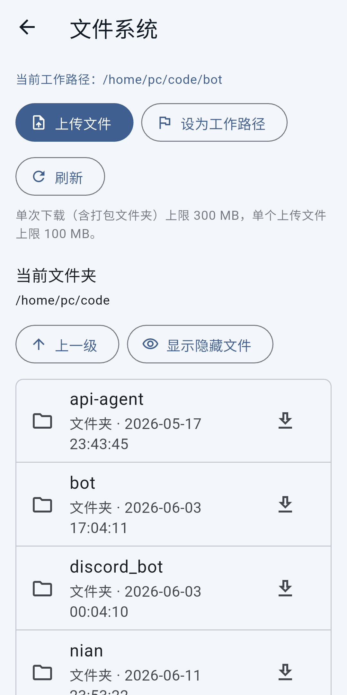
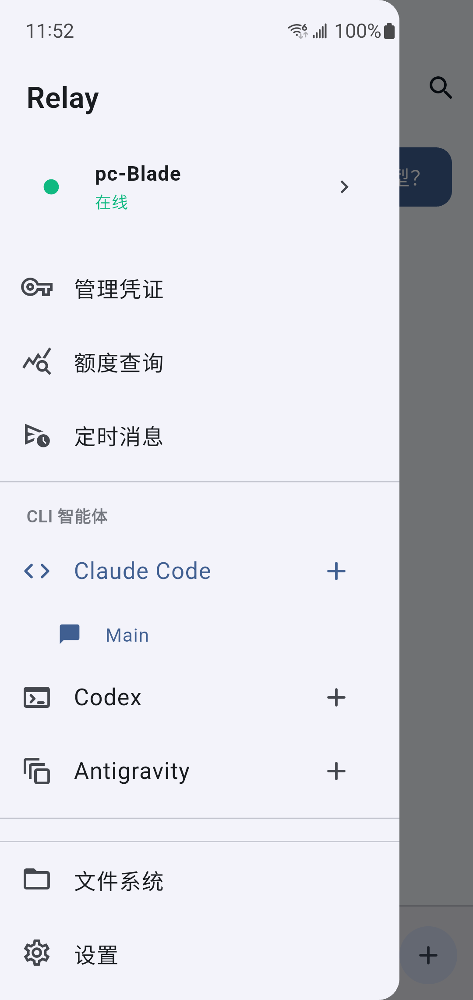
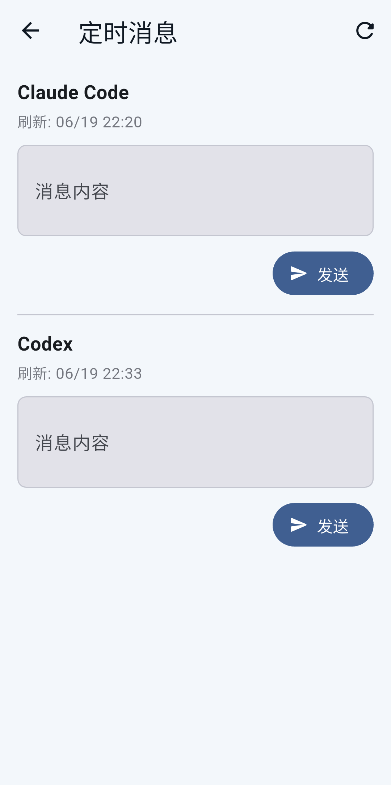
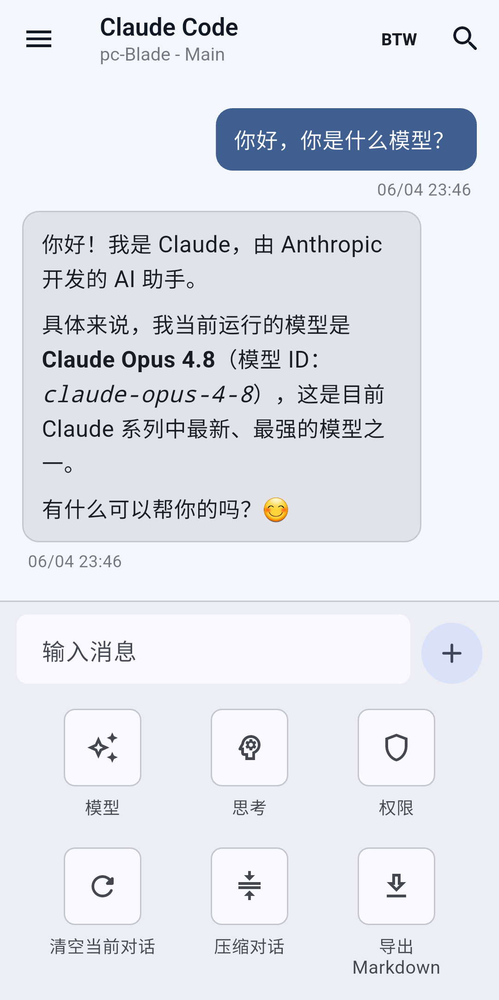

<div align="center">

# Relay

**一个私有的远程控制台，用来操控已经跑在你自己机器上的 AI 编程智能体。**

[English](README.md) · [安全模型](SECURITY.md) · [路线图](docs/ROADMAP.zh-CN.md) · [技术手册](docs/handbook.md)

</div>

Claude Code、Codex、Antigravity、OpenCode、Hermes 最适合跑在你的项目、shell
和登录态都已经准备好的那台机器上。Relay 让它们继续留在那里，然后给你一个干净的
**手机、浏览器或桌面端 app**，让你在沙发上、公司里、路上，随时接回那台机器继续干活。

Relay 不是托管云服务。它没有 Relay 账号、没有共享 Relay 服务器，也不会在 app 里内置
某个默认后端地址。你只会连接到自己运行的后端，连接方式是一份由你生成、并用你自己的密码保护的
加密二维码凭证。



## 为什么用 Relay

- **不用反复 SSH。** 在一个 app 里和本机 CLI 智能体聊天，不用在每台设备上开终端。
- **统一控制面。** 同一处切换 agent、会话、模型、思考深度和权限级别。
- **长任务不断线。** 回复实时流式显示；切到别的会话后任务仍能继续，并可在完成时通知你。
- **多智能体蜂群。** 多个 agent 共享一份记录，用 `@` 点名召唤；同一条消息里点名多个成员时，它们会基于同一份对话快照并行回答。
- **文件就在手边。** 浏览后端机器目录、切换工作目录、上传文件、下载文件或文件夹。
- **额度感知。** 查看 Claude Code、Codex、Antigravity 的额度，预约额度刷新后的自动消息，并接收刷新提醒。

## 安全模型

Relay 的设计目标是：控制面留在你手里。

- **自托管后端。** app 只连接跑在你自己机器或服务器上的 Node 后端。
- **没有 Relay 云账号。** 项目不提供会看到你的 prompt、文件、token 或 agent 输出的托管中转服务。
- **加密凭证导入。** 安装脚本生成的 QR/JSON 凭证使用 PBKDF2-SHA256 和 AES-256-GCM 加密；密码不会写入磁盘。
- **每设备独立 token。** 导入凭证后，app 会把 bearer token 存进系统安全存储；后端可撤销和删除旧设备 token。
- **鉴权失败限速。** 错 token 的尝试会被节流，正常的已鉴权流式请求不会因此被误伤。
- **文件 API 有敏感路径保护。** Relay 会拒绝读取 Relay token、`.env`、凭证导出、推送 token、`~/.ssh` 和已知 CLI 登录文件；正式部署还可以用 `RELAY_FS_ROOTS` 把文件浏览限制到指定目录。
- **优先 HTTPS。** 公开访问建议使用正式 Cloudflare Tunnel 或 TLS 反向代理；如果把公网可达地址配置成 `http://`，后端启动时会明确警告。

Relay 不会把 CLI agent 变成沙箱。后端会以运行它的系统用户身份启动真实 CLI 工具，所以你仍然需要限制后端用户能访问的目录，并认真选择每个 agent 的权限模式。公开部署前请先看
[SECURITY.md](SECURITY.md) 和[生产部署手册](docs/handbook.md#production-deployment)。

## 界面预览

### 首页：你的控制中心

首页展示当前机器、最近使用的蜂群、最近使用的智能体会话和“开始使用”入口，每台设备打开后都能回到同一个工作视图。

<div align="center">
  
</div>

### 一个聊天 app，操控所有 agent

在同一个界面里切换 Claude Code、Codex、Antigravity、OpenCode 和 Hermes。回复实时流式显示；多段更新带独立时间戳且可折叠；模型、思考深度和权限直接在输入区里选择。

<div align="center">
  
</div>

### 蜂群：多个 agent 共享同一份记录

创建一个蜂群，选择它的工作目录，加入多个成员，并给每个成员设置模型、权限、昵称和人设。消息里点名一个或多个成员，被点名的 agent 会基于同一份对话快照回答。

<div align="center">
  
</div>

### 额度与定时消息

查看 Claude Code、Codex、Antigravity 的剩余额度。你可以提前写好一条 prompt，让它在下一次 5 小时额度窗口重置后自动发送，并收到系统通知。

<div align="center">
  
</div>

### 直接操作后端机器上的文件

浏览项目目录、切换当前工作目录、上传文件、下载文件或打包后的文件夹，都在同一个远程控制面里完成。

<div align="center">
  
</div>

## 快速开始

你需要：

- 一台自己掌控的后端机器：Linux、macOS、Windows，或云 VPS。
- 后端机器上安装 Node.js 18+。
- 至少一个已经安装并登录的 CLI agent：Claude Code、Codex、Antigravity、OpenCode 或 Hermes。
- 在控制设备上运行 Relay app 或 Web 版。

在后端机器的 Relay 仓库根目录运行对应操作系统的安装脚本：

```bash
./backends/linux/setup.sh
```

```bash
./backends/macos/setup.sh
```

```powershell
.\backends\windows\setup.ps1
```

安装脚本会询问 app 如何访问后端：

| 模式 | 适合场景 | 说明 |
|------|----------|------|
| 直连模式 | VPS 或有公网 IP/域名的主机 | 公开使用时请在前面放 HTTPS。 |
| Cloudflare Tunnel | 长期稳定的个人部署 | 使用你自己的 Cloudflare 域名和稳定 hostname。 |
| Cloudflare Quick Tunnel | 快速试用 | 不需要域名，但重启后 URL 可能变化。 |

安装完成后，脚本会打印一张加密凭证二维码，并在 `server/credentials/` 下保存对应的 JSON 文件。打开 Relay，通过扫码、上传二维码图片或粘贴 JSON 导入凭证；输入你生成凭证时设置的密码，就可以开始使用。

首次连接页也内置了 **部署后端** 指南，会用同样的五步流程带你完成部署。

## 正式部署建议

稳定部署时建议：

- 后端保持 `HOST=127.0.0.1`，前面放 Cloudflare Tunnel、Caddy、Nginx 或其他 TLS 反向代理。
- `PUBLIC_BASE_URL` 设置为用户导入凭证时实际访问的 HTTPS 地址。
- 每台设备单独生成凭证；不要共用长期 token，旧设备直接撤销。
- 后端用非 root 用户运行，并只给它访问目标项目目录的权限。
- 如果文件浏览只应该覆盖部分目录，设置 `RELAY_FS_ROOTS`。

完整清单见[技术手册](docs/handbook.md#production-deployment)。

## 更多界面

<div align="center">
  
  
  
</div>

## 项目结构

```text
Relay/
├── assets/       app 资源：截图、图标、agent 图片
├── backends/     Linux、macOS、Windows 后端安装脚本
├── lib/          Flutter 客户端，覆盖移动端、Web 和桌面端
├── server/       Node 后端，对接本地 CLI 智能体
├── docs/         技术手册、路线图和贡献者笔记
└── scripts/      本地开发和构建辅助脚本
```

想参与贡献或深入内部实现？先看 [docs/AGENT.md](docs/AGENT.md) 和[技术手册](docs/handbook.md)。
